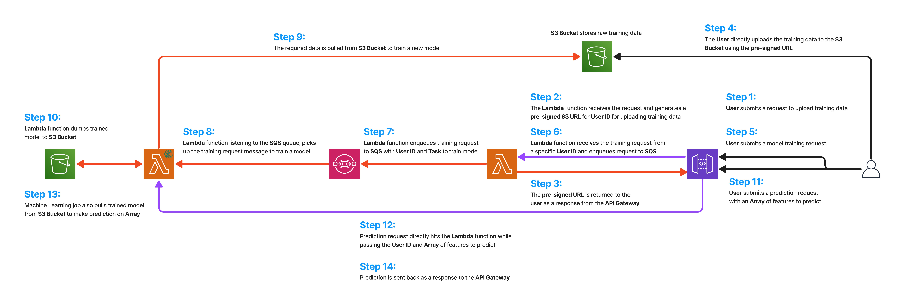

# AWS Predictive Platform
A predictive platform setup on AWS using Localstack.

- This project is a POC of a Machine Learning predictive platform based on an **Event Driven Architecture**.

- The current deployment of the platform uses the **Iris Dataset** to train a **Support Vector Machine Binary Classifier**.

<p align="center"></p>

- The training data is supplied to the platform in a `.npy` format. For the purpose of demonstration, a `.npy` file for the **Iris Dataset** has been provided in the `app` directory and instructions have been given below to upload the dataset and train the model.

- The training data accepts a default format where the last column is the target and remaining columns are features on which the Machine Learning model will be trained.

- The **Lambda** function handling the generation of *pre-signed URL* and sending a training request to **SQS** is a Javascript based function.

- The **Lambda** function handling training and prediction of the machine learning model is a Python based function.

- The **SQS** decouples the platform to allow asynchronous training of machine learning models.

## Steps to run source code

### 1. Clone this repository
- Clone the repsoitory.
```shell
git clone https://github.com/prasadashu/aws_predictive_platform.git
```

- Change directory to the cloned directory.
```shell
cd explore_localstack
```

### 2. Build the infrastructure
- Run the below shell script to build the platform.

    - We are using `source` to run the shell file to export environment variables.
    - The exported environment variables are used in other shell files.

```shell
source build_infrastructure.sh
```

### 3. Upload training data
- Change directory to `app`.
```shell
cd app
```

- The client shell file has two parameters.

    - Pass `--userid` value specific to the user.
    - Pass `--file` as the training data.
    
| :exclamation: | Note: For the purpose of demonstration, a `sample_data.npy` file has already been given in the `app` directory. |
|---------------|:------------------------|
```shell
bash client_app.sh --userid=<sample_userid> --file=sample_data.npy
```

### 4. Begin the training process
- Hit the **Platform** REST API on the `train` endpoint to begin the training process.

    - Pass `--userid` value as specified above.

```shell
curl -s -d '{"userID":"<sample_userid>"}' -H "Content-Type: application/json" -X POST "http://localhost:4566/restapis/$PLATFORM_API_ID/test/_user_request_/train"
```

### 5. Get predictions on sample data
- Hit the **Predictive** REST API with sample instance on the `prediction` endpoint.

    - Pass `userid` value as specified above.
    - Pass `array` as a numeric array corresponding to the features.

```shell
curl -s -d '{"userID":"<sample_userid>", "array": [6.5, 2.8, 4.6, 1.5]}' -H "Content-Type: application/json" -X POST "http://localhost:4566/restapis/$PREDICTIVE_API_ID/test/_user_request_/prediction"
```

## Refrences
- Further documentation to expand functionality using AWS SDK can be found in the below link: [AWS SDK Documentation](https://docs.aws.amazon.com/AWSJavaScriptSDK/v3/latest/clients/client-s3/index.html)